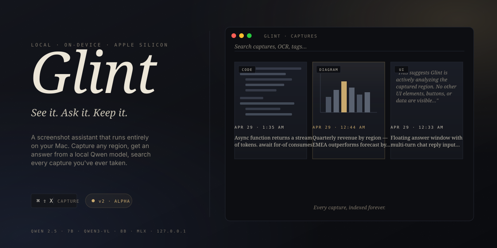

<div align="center">



<br />

**Local-first AI for Apple Silicon — screenshots, chat, and now Lens.**

🔍 **NEW: Lens (`⌘⇧L`)** — watch your Claude Code sessions live. Lens reads each turn off the JSONL transcript and explains what just happened, on-device, in real time.

Plus the original Glint workflow: press `⌘⇧X`, drag a region, get a streaming AI answer. All inference runs on your Mac — no cloud, no telemetry, no tracking.

[](https://github.com/jamesjoonkim/Glint/releases/latest)
[](https://github.com/jamesjoonkim/Glint/tree/feature/v2-rebuild)
[](https://www.apple.com/mac/)
[](LICENSE)
[](#development)
[](https://www.typescriptlang.org/)

[Install](#install) · [Lens](#lens-watch-your-claude-code-sessions) · [How it works](#how-it-works) · [Privacy](#privacy) · [Development](#development) · [Roadmap](#roadmap)

</div>

---

## Lens — watch your Claude Code sessions

Press `⌘⇧L` and pick a Claude Code session. Lens tails the JSONL transcript Anthropic writes for every CC conversation, parses each turn (user message, tool call, file edit, assistant response), and pipes it through a local model that explains what's happening — turn by turn, in plain English.

Why it's useful:

- **Learn from your own sessions.** New to a codebase, a framework, or just curious *why* CC reached for a particular tool? Lens narrates the reasoning live.
- **Onboard others without screen-sharing.** A junior dev can replay a senior's CC session with explanations layered on top.
- **Catch the moment things drift.** Lens flags when a turn looks "messy" — overconfident edits, half-finished refactors, missing test coverage.

Lens runs against the same on-device Qwen models as the rest of Glint. Your transcripts never leave your Mac.

## What else it does

Capture any region of any monitor with a global hotkey. Glint OCRs the image, routes it to either a text or vision LLM running locally, and streams the answer into a floating response window. Every capture is saved to a searchable, taggable, replayable archive — also entirely local.

| Hotkey | Action |
|--------|--------|
| `⌘⇧L` | **Lens** — watch & explain a live Claude Code session |
| `⌘⇧X` | Drag-select any region → AI answer streams into a floating window |
| `⌘⇧Z` | Open a direct chat with the local model — no screenshot |
| `⌘⇧H` | Open the searchable history archive |
| `⌘,` | Settings |

Inside the response window you can ask follow-ups; vision-route captures keep the original image in the model's context so you can probe the screenshot conversationally.

## How it works

```
                ┌─────────────────────┐
   ⌘⇧X  ───►   │   Selection overlay │  draws region, captures PNG
                └──────────┬──────────┘
                           │
                ┌──────────▼──────────┐
                │   tesseract.js OCR  │  text density + confidence
                └──────────┬──────────┘
                           │
                ┌──────────▼──────────┐
                │     density router  │  text-heavy? → text model
                └─────┬──────────┬────┘  image-heavy? → vision model
                      │          │
              ┌───────▼──┐    ┌──▼─────────┐
              │ Qwen2.5  │    │  Qwen3-VL  │      both running on
              │   7B     │    │     8B     │      mlx_lm.server
              │ (text)   │    │ (vision)   │      bound to 127.0.0.1
              └────┬─────┘    └─────┬──────┘
                   │                │
                ┌──▼────────────────▼──┐
                │   streaming response │  SSE → response window
                │   + history archive  │  PNG + OCR + turns → SQLite
                └──────────────────────┘
```

The two models run as separate subprocesses. The router classifies each capture by text density and OCR confidence and dispatches to whichever model fits — text-heavy screenshots (code, articles, errors) go to the text model with the OCR transcription as input; everything else (charts, photos, UI) goes to the vision model with the image attached. Follow-ups on a vision capture re-route through the vision model with the original image preserved on the first turn, per Qwen3-VL's chat-template guidance.

## Privacy

The privacy promise is **enforced at lint and runtime**, not just claimed:

| Mechanism | What it prevents |
|-----------|------------------|
| Custom ESLint rule on `src/core/**` | No `electron`, `axios`, `node-fetch`, or raw `fetch` — only `core/models/` and `core/embed/` are exempt, and those talk exclusively to `127.0.0.1` |
| `mlx_lm.server --host 127.0.0.1` | Bound to loopback. An integration test attempts a `0.0.0.0` connect and asserts refusal |
| `glint-asset://` custom protocol | Renderer cannot reference arbitrary file paths; assets are resolved by capture-id through a DB lookup with directory-containment checks |
| Logger redaction | OCR text, file paths, and tags never reach disk |
| No telemetry, no auto-update probes | Manual download from Releases. Crash reporting opt-in, off by default |

After a one-time model download (~12 GB), the app makes zero outbound network calls during normal operation.

### One opt-in exception: web search

Glint can autonomously call out to the web when the model decides it needs current information (recent news, prices, breaking events). This is **off by default** because it breaks the local-only promise — the search query travels to the configured backend. To enable, edit `~/Library/Application Support/Glint/settings.json`:

```jsonc
{
  "webSearch": {
    "enabled": true,
    "tavilyApiKey": "tvly-…",   // get a free key at https://tavily.com
    "maxIterations": 2          // cap on tool-loop rounds per send
  }
}
```

When the model invokes a search, the response window shows a `searching the web · <query>` banner so the leak is always visible. Settings UI ships in a future release; for now, the JSON file is the source of truth.

## Install

### Download the DMG

Grab the latest build from the [**Releases page**](https://github.com/jamesjoonkim/Glint/releases/latest). Drag `Glint.app` into `/Applications`.

> **First launch — important.** v2 alpha DMGs are **unsigned**. macOS will refuse to open the app on the first try with either:
> - *"Glint is damaged and can't be opened"* (macOS 15+), or
> - *"Glint can't be opened because Apple cannot check it for malicious software"* (macOS 13–14).
>
> The file is not actually damaged. To clear Gatekeeper's quarantine flag, run this once in Terminal:
>
> ```bash
> xattr -cr /Applications/Glint.app
> ```
>
> Then open Glint normally. Signed + notarized builds are on the roadmap.

### Build from source

```bash
git clone https://github.com/jamesjoonkim/Glint.git
cd Glint
git checkout feature/v2-rebuild
nvm use            # Node 20
npm install
npm run dev
```

For real LLM inference, build the bundled MLX runtime locally (Apple Silicon + Python 3.11):

```bash
bash build/python/build-runtime.sh
```

Or run the dev loop in fake-LLM mode (deterministic fixture stream — no weights needed):

```bash
GLINT_LLM=fake npm run dev
```

### System requirements

- macOS 13.0+
- Apple Silicon (M1, M2, M3, …) — required for MLX
- 16 GB RAM recommended (vision model ~6 GB resident)
- ~12 GB free disk after first run

## Architecture

Three layers separated by a hard import boundary:

| Layer | Responsibility | Imports |
|-------|----------------|---------|
| `src/main/` | Electron orchestration: lifecycle, windows, hotkeys, IPC, custom asset protocol | Electron + Node |
| `src/core/` | Pure logic: OCR, router, model client, history store, threads, thumbnails | Node only — **no Electron** |
| `src/renderer/` | React UI: SelectionOverlay, ResponseWindow, HistoryPanel, FirstRun, Settings | DOM only |

The split exists so `core/` can be unit-tested in plain Node and so the privacy contract can be lint-enforced.

See [`docs/superpowers/specs/2026-04-28-glint-v2-design.md`](docs/superpowers/specs/2026-04-28-glint-v2-design.md) for the full design and [`docs/plans/glint-v2-plan.md`](docs/plans/glint-v2-plan.md) for the day-by-day implementation plan. Open [`docs/plans/glint-v2-interactive-plan.html`](docs/plans/glint-v2-interactive-plan.html) for a visual walkthrough.

## Development

```bash
npm run dev          # Vite + Electron with HMR
npm test             # Vitest unit + integration  (49 tests)
npm run test:watch
npm run test:coverage
npm run test:e2e     # Playwright on packaged Electron
npm run typecheck    # tsc --noEmit (strict)
npm run lint         # ESLint (incl. core/ network ban)
npm run package      # Forge package (unsigned)
npm run make         # Forge make DMG
```

### Dev mode env flags

| Flag | Effect |
|------|--------|
| `GLINT_LLM=fake` | Replaces the model client with a deterministic fixture stream — no MLX runtime required |
| `GLINT_OCR=fake` | Stubs OCR for capture-pipeline tests |
| `GLINT_DEBUG=1`  | Verbose `pino` logging to stdout |

### Project layout

```
src/
├── main/            # Electron main process — windows, hotkeys, IPC
│   ├── pipeline.ts  # capture → OCR → route → stream → persist
│   ├── asset-protocol.ts   # glint-asset:// resolver
│   └── windows/     # overlay, response, history, settings
├── core/            # Pure logic (no Electron)
│   ├── ocr/         # tesseract.js wrapper
│   ├── router/      # density classifier
│   ├── models/      # mlx_lm.server client (localhost-only)
│   ├── history/     # SQLite store, thumbnails, backfill
│   └── threads/     # tag classifier, title generator
├── renderer/        # React UI (CSS Modules, no global CSS)
└── shared/          # Type-only, importable by all three layers

tests/unit/          # Vitest — runs against real SQLite migrations
tests/e2e/           # Playwright on a packaged build
```

## Roadmap

- [x] Capture pipeline + density router + dual-model dispatch
- [x] Local SQLite history with FTS5 keyword search
- [x] Thumbnail generation + backfill
- [x] Custom `glint-asset://` protocol for safe in-renderer image loading
- [x] Multi-turn chat — text-route and vision-route follow-ups
- [x] Image-in-replay (original screenshot rendered as the first chat turn)
- [x] Direct chat mode (`⌘⇧Z`) for question-answering without a screenshot
- [x] Captures / Chats tabs in the dashboard with per-tab search
- [x] In-chat image attachments — paste, drag, or marquee-capture into the active thread
- [x] Multi-image composed turns — bundle N images + text into one assistant response
- [x] Stop-button mid-stream + partial-answer persistence
- [x] Opt-in web search via Tavily with autonomous tool-call loop
- [x] **Lens** — live Claude Code session observer with on-device explanations (`⌘⇧L`)
- [ ] First-run wizard for model download
- [ ] Semantic search over OCR text and assistant turns (sqlite-vss)
- [ ] Settings UI for web search, model selection, hotkey rebinding, log retention
- [ ] Image fetch from web search (download top results into composed-turn context)
- [ ] Signed + notarized DMG (Apple Developer Program) + optional auto-update (off by default)

v1 (cloud GPT-4V) is preserved at the [`v1-final` tag](https://github.com/jamesjoonkim/Glint/tree/v1-final) for reference.

## License

MIT — see [LICENSE](LICENSE).

## Credits

- Local inference via [MLX](https://github.com/ml-explore/mlx) and the [`mlx-community`](https://huggingface.co/mlx-community) model collection on Hugging Face
- OCR via [tesseract.js](https://github.com/naptha/tesseract.js)
- Markdown rendering via [react-markdown](https://github.com/remarkjs/react-markdown) + [rehype-sanitize](https://github.com/rehypejs/rehype-sanitize)
- Local SQLite via [better-sqlite3](https://github.com/WiseLibs/better-sqlite3)
- Image processing via [Jimp](https://github.com/jimp-dev/jimp)

---

<div align="center">

Built by [James Kim](https://github.com/jamesjoonkim).
If Glint helps your workflow, [open an issue](https://github.com/jamesjoonkim/Glint/issues) — feedback shapes v2.

</div>
